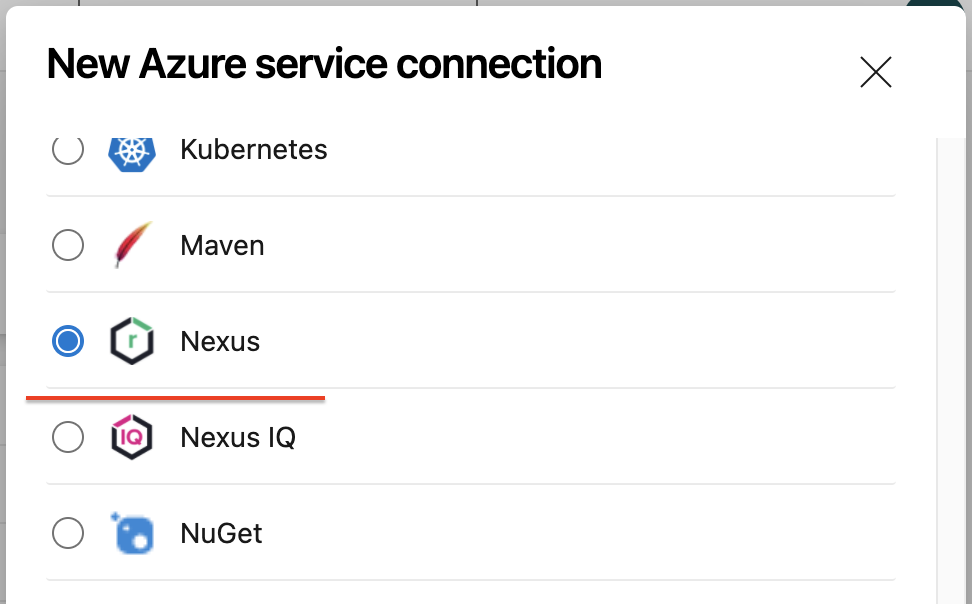
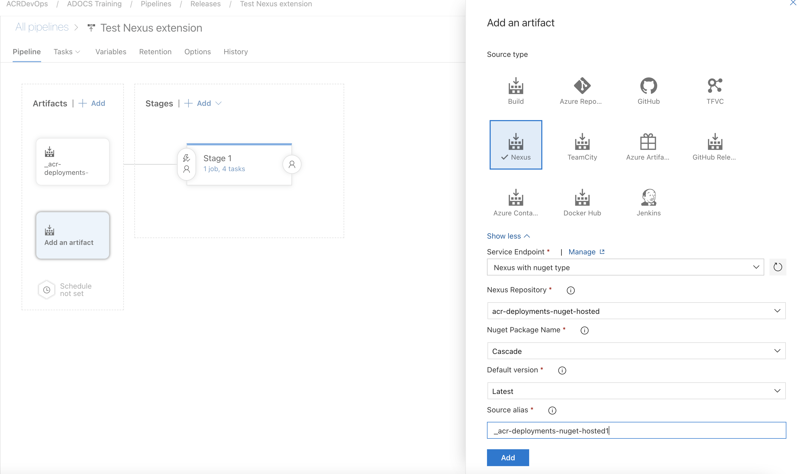

# Nexus artifacts for Release management

This extension is an integration point for Nexus with Release management in Azure DevOps. With this extension, you can deploy artifacts from Nexus builds using Release management. 

**Note:** This extension work only with Azure DevOps.

## Usage
This extension provides a service endpoint to connect to Nexus account with username and password. Once connected, you can link nuget packages from the Nexus repository manager and deploy the same using Release management orchestration service.

### Connecting to a Nexus project
Go to project settings -> Services tab and create a New Service Endpoint of type Nexus:

### Linking a Nexus build
Once you have set up the service endpoint connection, you would be able to link an Nexus build artifact in your release definition

[Learn more about artifacts in Release Management](https://msdn.microsoft.com/library/vs/alm/release/author-release-definition/understanding-artifacts). Also you can use [Azure Pipeline Extensions on Github](https://github.com/Microsoft/azure-pipelines-extensions/issues) to report any issues.

## Contact Information

To report a problem with this extension, create an issue in [DevOps support](https://acrjira.acr.org/servicedesk/customer/portal/51).

